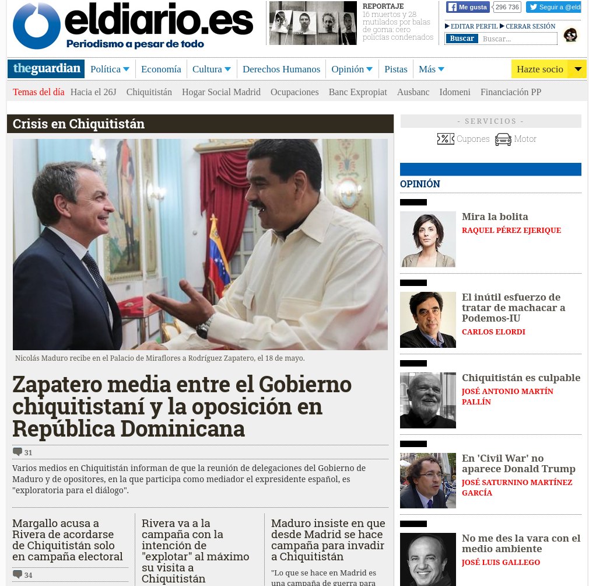

# firefox-addon-venezuela-no-more

A funny Firefox addon to get away from Venezuela when you read the Spanish press.

**SETUP:**  [Install in your firefox web browser here.](https://addons.mozilla.org/es/firefox/addon/venezuela-no-more/  "Setup")

*(There is a Chrome version too here: [bameda/chrome-ext-venezuela-no-more](https://github.com/bameda/chrome-ext-venezuela-no-more))*




### For developers

Install jpm

```
npm install jpm --global
```

Them, in `src`:

- `jpm run -b /usr/bin/firefox` - Teat
- `jpm xpi` - Make package
